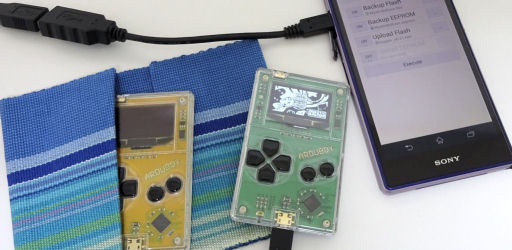
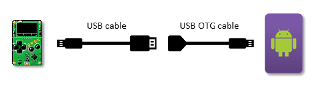

# Arby Utility
This is an android application to upload Flash image data to Arduboy. \
https://play.google.com/store/apps/details?id=com.obnsoft.arduboyutil \

## Functions
 - Upload Flash or/and EEPROM to Arduboy.
 - Backup Flash or/and EEPROM from Arduboy.
 - Serial monitor.
 - Decode screen image from memory dump through serial monitor.

## How to use
 - Assumption: your Android device has the capability of USB host and you have a USB OTG cable.
 - Connect Arduboy and Android device like following: \
   
 - If confirm dialog is appeared when Arduboy is connected, check "Use by default for this USB device".

## Acknowledgement

### Notice
Arduboy is a registered trademark of Arduboy, Inc. This application is not created by or licensed by Arduboy, Inc. So, DO NOT inquire of Arduboy, Inc. about this.
This comes with no warranties. This should be used at your own risk. The author of this has no responsibility.

### Libraries
 - [Physicaloid Library](https://github.com/ksksue/PhysicaloidLibrary)
 - [Java IntelHex Parser Library](https://github.com/j123b567/java-intelhex-parser)

### Image resources
 - Some icons are generated by [無料素材サービス](https://sozai.cman.jp/).

## License
Apache License, Version 2.0
